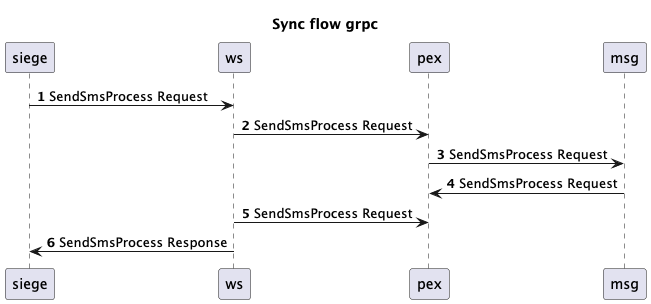
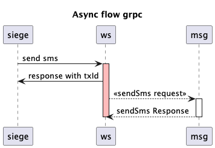

# Spring Boot GRPC Project Example

### **Multi-Module Spring Boot and gRPC Example Project**

#### **Project Overview**
This project serves as a practical implementation of **gRPC within a Spring Boot multi-module architecture**, enabling efficient, high-performance service-to-service communication. It provides a structured approach to building scalable microservices, leveraging **gRPC** for **low-latency, high-throughput** interactions while maintaining **compatibility with traditional REST clients**.

#### **Architecture & Communication Patterns**
- **Client Interaction:**
  - A RESTful API, exposed via **HTTP 1.1**, is served through a **Tomcat web server**.
  - The client communicates via standard REST endpoints, interacting with the underlying gRPC-based services.

- **Inter-Module Communication:**
  - Modules interact with each other via **gRPC**, supporting both:
    - **Synchronous communication** for real-time request-response interactions.
    - **Asynchronous communication** using gRPC streaming for event-driven processing.

#### **Key Features & Enhancements**
- **Spring Boot Integration:**
  - Seamlessly integrates **gRPC server and client** with the Spring Boot application context.
  - Uses **Spring Boot’s dependency injection (DI) and configuration management** for gRPC services.

- **Governance & Observability:**
  - **Logging:** Comprehensive gRPC request/response logging for debugging and monitoring.
  - **Header Enrichment:** Metadata propagation to enhance service traceability.
  - **Security:** Implementing authentication/authorization strategies such as JWT, mTLS, and API keys.

- **Scalability & Performance Optimizations:**
  - **Load balancing**: Configuring client-side or service-side load balancing for high availability.
  - **Connection pooling**: Efficient management of gRPC channels to optimize resource usage.
  - **Resilience mechanisms**: Implementing timeouts, retries, and circuit breakers to handle failures gracefully.

#### **Benefits & Use Cases**
✅ **Low-latency, high-performance communication** between microservices.  
✅ **Efficient resource utilization** with persistent connections.  
✅ **Hybrid integration**: Supports both gRPC-based service-to-service calls and RESTful clients.  
✅ **Enhanced security and governance** for production-grade deployments.  
✅ **Scalable and modular design** for large-scale microservices architectures.

🚀 This project provides a **solid foundation for building microservices** using **Spring Boot and gRPC**, combining **modern communication patterns with enterprise-grade best practices**.

### Flows






### Testing

MacOS

```shell
brew install grpcurl
```

#### GRPC URL
```curl
grpcurl -v -d '{"smsHeader": "1234", "msgTxt":"Hello pims" , "receiverMsisdn" : "905557502861", "txKey" : "TX-1" }' \n
-plaintext localhost:9090 com.inomera.pims.sal.MessagingService/sendCustomerAcknowledgeMsg
```

#### REST API

Async

```curl
curl --location 'http://localhost:8080/ws/rest/external/v10/messages/send/async' 
--header 'Content-Type: application/json' \
--data '{
    "smsHeader": "1234",
    "msgTxt": "Hello pims",
    "receiverMsisdn": "905557502861",
    "txKey": "TX-1"
}'
```

Sync

```curl
curl --location 'http://localhost:8080/ws/rest/external/v10/messages/send/process' 
--header 'Content-Type: application/json' \
--data '{
    "smsHeader": "1234",
    "msgTxt": "Hello pims",
    "receiverMsisdn": "905557502861",
    "txKey": "TX-1"
}'
```

### Load Test with Siege 

MacOS

```shell
brew install siege
```

you can find siege files under files directory.

concurrent 5 users, no delay, 30 seconds

```bash
#!/bin/bash

siege -d0 -c5 -t30S \
-H 'Content-Type: application/json' \
'http://localhost:8080/ws/rest/external/v10/messages/send/process POST { "header": "7070","msisdn": "905077505015","text": "Hoş geldin process GRPC"}' \
-H 'Accept:application/json' 
```

Output

```shell
Lifting the server siege...
Transactions:		       10211 hits
Availability:		      100.00 %
Elapsed time:		       31.03 secs
Data transferred:	        0.47 MB
Response time:		        0.00 secs
Transaction rate:	      329.07 trans/sec
Throughput:		        0.02 MB/sec
Concurrency:		        0.63
Successful transactions:       10211
Failed transactions:	           0
Longest transaction:	        6.72
Shortest transaction:	        0.00
```

### Tech Stack

* Spring Boot 3.4.2
* Spring GRPC Boot 0.4.0-SHAPSHOT
* GRPC 1.7.0
* Apache Tomcat 10+
* Protobuf

